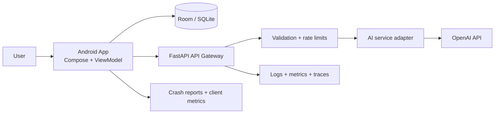
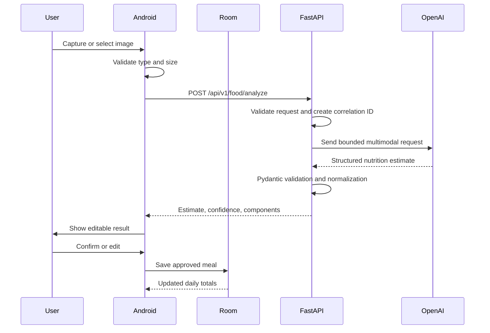

# 6. System Architecture

This document extends the original Cal.ai specification with an implementation architecture for scalability, observability, monitoring, logging, security, and operational resilience. It complements [Technical Architecture](03-technical-architecture.md), [MVP Delivery](04-mvp-delivery.md), and [Validation and Roadmap](05-validation-roadmap.md).

## 6.1 Architectural Goals

- Keep food logging fast and low-friction.
- Keep nutrition estimates clearly approximate and editable.
- Keep the Android app useful when the network is unavailable.
- Keep the backend stateless so API instances can scale horizontally.
- Keep OpenAI credentials and provider-specific logic behind the backend.
- Make failures visible, diagnosable, and recoverable.
- Protect sensitive food images, meal data, credentials, and operational data.
- Avoid introducing production-scale infrastructure before the MVP needs it.

## 6.2 Architecture Style

Cal.ai uses a local-first mobile client, a stateless API gateway, and an external AI provider.

### MVP deployment

- One Android application.
- One FastAPI service deployed behind HTTPS.
- Room / SQLite as the local source of truth for meals and daily totals.
- No server-side application database required for the core MVP.
- OpenAI accessed only from FastAPI.
- A managed log and error sink is recommended, but the MVP may begin with platform logs and basic uptime checks.

### Production evolution

- Multiple FastAPI instances behind a load balancer.
- Managed relational database for optional accounts, synchronization, audit metadata, and aggregate analytics.
- Object storage for explicitly retained images, protected by private access and lifecycle deletion.
- Background worker and queue for non-interactive insight generation or retries.
- Managed secrets, metrics, traces, logs, alerting, and dashboards.

The production additions are optional extensions. They must not change the MVP contract that Room stores local meals and that AI results are reviewed before saving.

## 6.3 Component Responsibilities

### Android application

- Present Home, Scan, Analysis, Result, Chat, Diary, History, Add Meal, and Settings screens.
- Capture images with CameraX and choose images from the gallery.
- Keep UI state in ViewModels and expose it through StateFlow.
- Validate basic input before network calls.
- Send requests through Retrofit / OkHttp.
- Persist saved and edited meals in Room.
- Queue or clearly retry failed AI requests without duplicating saved meals.
- Display estimates, confidence, uncertainty, loading, and error states.
- Never contain the OpenAI API key.

### FastAPI API gateway

- Expose the versioned food analysis, text logging, and chat endpoints defined in the specification.
- Enforce request size, content type, field, and value limits.
- Authenticate and authorize production users when accounts are introduced.
- Apply rate limits and request correlation IDs.
- Normalize errors into stable client-safe responses.
- Call the AI service adapter with timeouts and bounded retries.
- Validate AI output with Pydantic before returning it.
- Emit structured logs, metrics, and traces without recording secrets or raw images.

### AI service adapter

- Own prompts, model selection, structured output configuration, and provider error mapping.
- Keep image analysis and text analysis contracts consistent.
- Treat all nutrition values as estimates.
- Reject malformed, unsafe, or incomplete provider responses.
- Record model and prompt-version metadata for debugging, without storing sensitive prompt content unnecessarily.

### Room data layer

- Store `MealEntity` records locally.
- Provide insert, query-by-day, query-between-dates, update, delete, and daily-total operations.
- Use stable IDs and idempotent save behavior.
- Calculate dashboard totals from persisted meal records rather than duplicated UI state.

## 6.4 Request and Data Flow

### Food image analysis

### Important boundaries

- Images are transient by default. Do not persist or log raw images unless a future feature explicitly requires retention and the user has been informed.
- The backend does not write a meal to Room; only the Android client saves the user-approved result.
- The backend response is not a medical diagnosis or a verified nutrition record.
- Chat receives the minimum daily context needed to answer the question.

## 6.5 API Reliability and Scalability

### Stateless service design

FastAPI instances must not depend on in-memory sessions, local files, or local queues. Any request can be handled by any instance. Configuration is loaded from environment or a secrets manager at startup.

### Timeouts and retries

- Set a client timeout for Android-to-backend requests.
- Set a shorter, explicit timeout for FastAPI-to-OpenAI requests.
- Retry only transient failures such as connection resets or selected 5xx responses.
- Use exponential backoff with jitter and a small retry limit.
- Never blindly retry validation failures, authentication failures, invalid images, or quota errors.
- Use an idempotency key for interactive analysis retries when the backend supports request tracking.

### Rate and resource limits

- Limit image size, MIME types, pixel dimensions, and request body size.
- Limit chat message length and request frequency per client or authenticated user.
- Bound concurrent AI calls per instance.
- Return `429` for rate limits and `503` for temporary provider capacity issues.
- Use circuit breaking or temporary fail-fast behavior when OpenAI is unhealthy.

### Horizontal scaling path

1. Keep the API stateless.
2. Put it behind an HTTPS load balancer.
3. Scale instances based on request rate, latency, CPU, memory, and in-flight AI calls.
4. Move long-running or non-interactive work to a queue and worker.
5. Add a managed database only for server-side data that the product actually needs.
6. Add caching only for safe, non-personalized data; never cache private meal results by raw image.

## 6.6 Observability

Observability has three connected signals: logs explain events, metrics show behavior over time, and traces show request dependencies.

### Correlation and identity

- Generate a server-side `request_id` for every request.
- Propagate a W3C trace context where supported.
- Include endpoint, status code, latency, service version, and environment in telemetry.
- Use a pseudonymous user or installation identifier only when needed; do not use raw email, food descriptions, or image content as identifiers.

### Structured logging

Use JSON logs with fields such as:

- Timestamp in UTC.
- Log level.
- Service and version.
- Environment.
- Request ID and trace ID.
- HTTP method, route template, status, and duration.
- Error class and safe error code.
- AI provider operation, model name, prompt version, and token usage if available.

Never log:

- `OPENAI_API_KEY` or any credential.
- Authorization headers or session tokens.
- Raw image bytes, base64 image data, or unrestricted image URLs.
- Full chat messages or food descriptions by default.
- Sensitive personal data.

Use redaction middleware and test it with deliberately sensitive sample values.

### Metrics

Track at minimum:

- Request count by endpoint and status class.
- API latency percentiles, especially p50, p95, and p99.
- 4xx and 5xx error rate.
- AI provider latency, failures, timeouts, and rate-limit responses.
- Food analysis success and validation-failure counts.
- Image rejection count by safe reason.
- Retry count and circuit-breaker state.
- Active requests and in-flight AI calls.
- Android crash-free sessions and network failure rate.
- Room save, update, and delete failures.

Do not use high-cardinality labels such as raw user IDs, meal names, request IDs, or image hashes in metric dimensions.

### Tracing

Trace the path from Android network request through FastAPI validation, AI adapter, OpenAI call, response validation, and client response. Capture timing and safe metadata. Disable or redact request and response bodies in production traces.

## 6.7 Monitoring and Alerting

Create dashboards for:

- Availability and endpoint error rates.
- API latency and OpenAI latency.
- AI success, timeout, quota, and validation failures.
- Request volume, rate limits, and cost indicators.
- Memory, CPU, instance count, and in-flight requests.
- Android crashes and failed meal saves.

Initial alerts should cover:

- API health check failure.
- Sustained 5xx rate above the agreed threshold.
- p95 latency above the user experience target.
- OpenAI timeout or failure spike.
- Unusual rate-limit or request-volume spike.
- Backend memory or CPU saturation.
- Repeated Android crash or Room persistence failures.

Alerts must include the affected component, time window, severity, dashboard link, and a runbook action. Avoid paging on one isolated failed AI request.

## 6.8 Security Architecture

### Secrets and configuration

- Store OpenAI keys and production credentials in a secret manager or protected environment variables.
- Keep `.env` out of version control.
- Use separate credentials for development, staging, and production.
- Rotate keys and revoke compromised credentials immediately.
- Never put backend secrets in the APK, source control, logs, crash reports, or client configuration.

### Transport and API security

- Enforce HTTPS in every non-local environment.
- Validate TLS certificates through the platform defaults; do not disable certificate validation.
- Use authentication and authorization before adding server-side personal data or synchronization.
- Validate all client input at the API boundary.
- Apply CORS narrowly for any web tooling; the Android client does not require a wildcard browser policy.
- Add security headers and restrict administrative endpoints.
- Keep dependencies patched and scan them regularly.

### Image and data protection

- Accept only supported image MIME types and enforce byte and dimension limits.
- Decode and process images safely; reject malformed files.
- Strip unnecessary metadata when creating an upload copy.
- Do not retain images after analysis unless the product explicitly needs it.
- Encrypt local sensitive storage where appropriate and use Android's secure storage for tokens.
- Provide deletion behavior for locally saved meals and any future server-side records.
- Define retention periods for logs, traces, crash reports, and uploaded images.

### AI-specific safety

- Treat user text and image-derived content as untrusted input.
- Keep system instructions separate from user content.
- Require structured output and validate ranges, for example non-negative calories and macros and confidence from 0 to 1.
- Do not let user input change system prompts, tool permissions, or backend configuration.
- Return safe, neutral errors without exposing provider details.
- Label estimates and avoid medical claims or personalized medical treatment advice.

## 6.9 Resilience and Failure Behavior

| Failure | Expected behavior |
| --- | --- |
| No network | Keep existing Room data available; show retry and manual entry options |
| Camera permission denied | Explain the requirement and offer gallery or settings recovery |
| Invalid image | Reject before upload and offer retake or gallery selection |
| OpenAI timeout | Stop after bounded retries, show a recoverable error, do not save partial data |
| OpenAI malformed output | Log validation failure safely, show analysis failure, offer manual entry |
| Backend unavailable | Show service-unavailable state and preserve the user's local workflow |
| Duplicate retry | Use client request identity or user confirmation to avoid duplicate saves |
| Room failure | Surface the persistence failure and do not claim the meal was saved |

## 6.10 Environments and Delivery

Use at least development, staging, and production configurations as the project matures.

- Development may use local FastAPI and test AI responses.
- Staging should exercise real request validation and observability with non-production credentials and test data.
- Production uses managed secrets, HTTPS, restricted access, backups for any server-side data, and alerting.

The CI pipeline should run formatting, linting, unit tests, API schema tests, dependency checks, and an Android build before deployment. Deploy versioned backend releases with a rollback path and record the deployed version in telemetry.

## 6.11 Architecture Decision Summary

| Decision | MVP | Scalable evolution |
| --- | --- | --- |
| Meal storage | Room / SQLite on device | Optional managed database and synchronization |
| API service | One FastAPI deployment | Stateless replicas behind a load balancer |
| AI execution | Synchronous request | Queue and worker for non-interactive work |
| Images | Transient processing | Private object storage only with explicit retention |
| Authentication | Out of MVP scope | Identity, authorization, and tenant isolation |
| Observability | Structured logs and health checks | OpenTelemetry, dashboards, SLOs, and alerting |
| Secrets | Protected environment variables | Managed secret store and rotation |

This architecture keeps the primary Cal.ai journey small and testable while making the operational boundaries explicit before the application grows.
